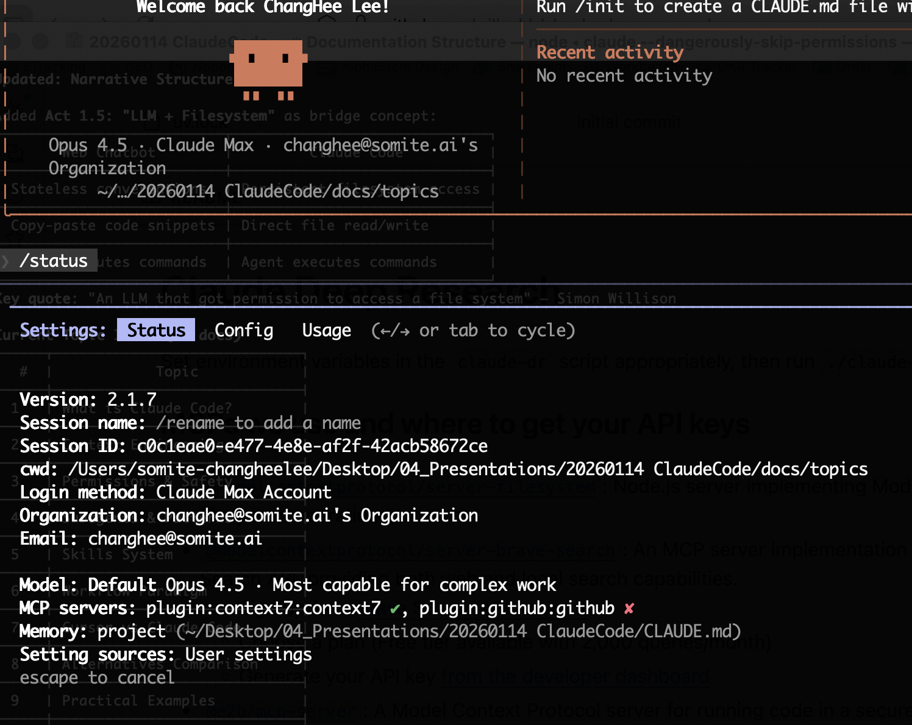
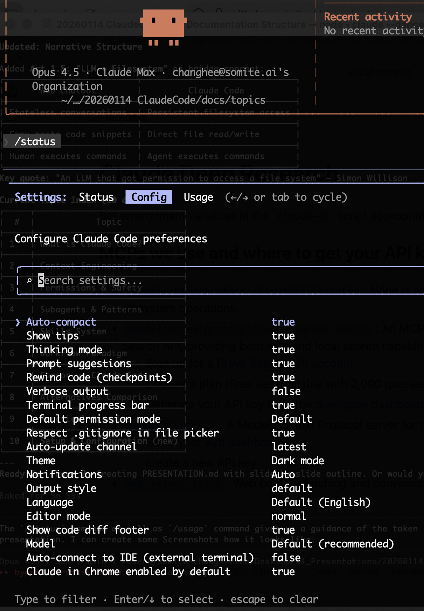
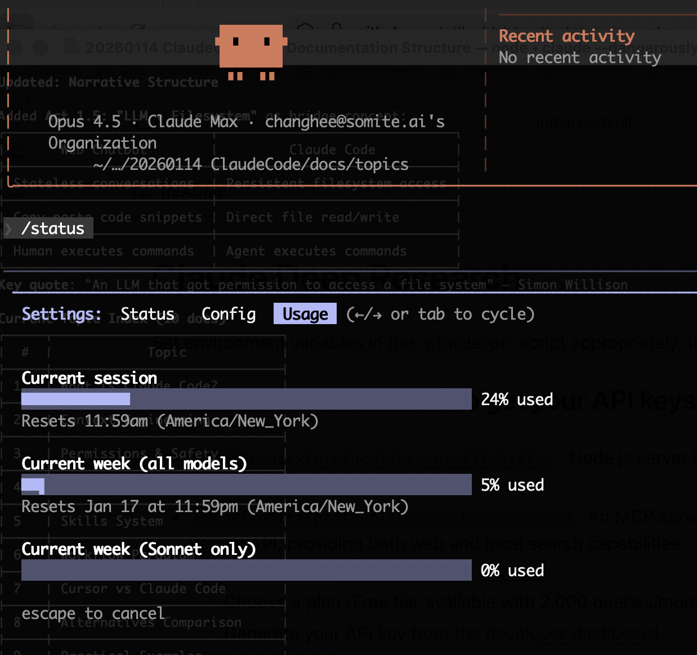

# Setup and Configuration

## Summary
Getting the most out of Claude Code requires proper configuration. This guide covers pricing/access, installation, statusline customization, plugin/skills setup, and project documentation with CLAUDE.md.

---

## Pricing and Access

### Access Methods

Claude Code uses your Claude account for authentication. You can access it through:
1. **Claude Web/Desktop subscription** (Pro, Max plans)
2. **API keys** (pay-per-token)

### Subscription Plans

| Plan | Price | Best For | Claude Code Access |
|------|-------|----------|-------------------|
| **Free** | $0 | Trying Claude | Limited |
| **Pro** | $20/month | Light usage, <1000 LOC repos | ~45 messages/5 hours |
| **Max 5x** | $100/month | Moderate usage, larger repos | ~225 messages/5 hours |
| **Max 20x** | $200/month | Heavy usage, complex projects | Higher limits + priority |
| **Team** | $25-150/user/month | Business teams | Shared billing, admin controls |

### What's Included

**Pro Plan ($20/month):**
- Access to Sonnet 4 model
- ~40-80 hours of Sonnet 4 weekly
- Usage shared across Claude web, desktop, and Code

**Max Plans ($100-200/month):**
- Access to both Sonnet 4 and Opus 4
- Automatic model switching to prevent hitting limits
- Priority access to new features and models
- Max 5x: ~15-35 hours Opus 4 + ~140-280 hours Sonnet 4 weekly
- Can purchase additional usage at API rates

### API Pricing (Per-Token)

For direct API access or additional usage beyond subscription:

| Model | Input (per 1M tokens) | Output (per 1M tokens) |
|-------|----------------------|------------------------|
| Claude Opus 4.5 | $5.00 | $25.00 |
| Claude Sonnet 4.5 | $3.00 | $15.00 |
| Sonnet 4.5 (>200K context) | $6.00 | $22.50 |

### Usage Limits

- Limits reset every **5 hours**
- Shared across Claude web, desktop, mobile, and Claude Code
- Factors affecting usage: message length, conversation duration, file attachments, parallel sessions, codebase complexity

### Recommendation

| Use Case | Recommended Plan |
|----------|-----------------|
| Occasional use, small projects | Pro ($20) |
| Daily development, medium projects | Max 5x ($100) |
| Heavy usage, complex codebases | Max 20x ($200) |
| Team collaboration | Team plan |
| Predictable costs, budget control | API with spending limits |

---

## Installation

### Basic Installation
```bash
# Using npm
npm install -g @anthropic-ai/claude-code

# Verify installation
claude --version
```

### First Run
```bash
cd your-project
claude
```

On first run, Claude Code will:
1. Authenticate with your Anthropic account
2. Create `~/.claude/` directory for global settings
3. Optionally run `/init` to generate project CLAUDE.md

---

## Monitoring Usage: /status Command

The `/status` command provides a comprehensive view of your session, configuration, and usage. Press `Tab` or use arrow keys to switch between tabs.

### Status Tab

Shows session information:
- **Version**: Claude Code version (e.g., 2.1.7)
- **Session ID**: Unique identifier for current session
- **Working directory**: Current project path
- **Login method**: Claude Max Account, Pro, or API
- **Model**: Current default model (e.g., Opus 4.5)
- **MCP servers**: Active plugins (e.g., plugin:context7, plugin:github)
- **Memory**: Loaded CLAUDE.md files



### Config Tab

View and modify configuration preferences:
- Auto-compact, thinking mode, prompt suggestions
- Rewind code (checkpoints)
- Theme (Dark mode, etc.)
- Model selection
- Terminal and output settings



### Usage Tab

**Critical for context engineering** - monitor your usage in real-time:

| Metric | Description |
|--------|-------------|
| **Current session** | Context window usage (e.g., "24% used") |
| **Session reset** | When the 5-hour window resets |
| **Current week (all models)** | Weekly usage across Opus + Sonnet |
| **Current week (Sonnet only)** | Sonnet-specific usage |



### Why Usage Monitoring Matters

- **Context window fills up** → model performance degrades
- **Approaching limits** → plan when to start fresh sessions
- **Weekly limits** → pace your heavy usage across the week
- **Model switching** → Max plans auto-switch when limits approach

### Related Commands

| Command | Purpose |
|---------|---------|
| `/status` | Full status dashboard (Status, Config, Usage tabs) |
| `/context` | Quick view of context window state |
| `/clear` | Clear conversation to free context |
| `/compact` | Compress conversation to save tokens |

---

## Statusline Configuration

The statusline displays real-time information at the bottom of the Claude Code interface.

### Quick Setup with /statusline

The easiest method - describe what you want:
```
/statusline show the model name and context usage percentage
```

Claude Code automatically creates the script and configuration.

### Manual Configuration

Add to `~/.claude/settings.json`:
```json
{
  "statusLine": {
    "type": "command",
    "command": "~/.claude/statusline.sh",
    "padding": 0
  }
}
```

### Available Data Fields

Claude Code pipes JSON to your statusline script via stdin:

| Field | Description |
|-------|-------------|
| `model.display_name` | Current model (e.g., "Claude Sonnet 4") |
| `model.id` | Model identifier |
| `tokens.input` | Input tokens used |
| `tokens.output` | Output tokens generated |
| `tokens.cache_read` | Cached tokens read |
| `cost.current` | Current session cost |
| `cost.total` | Total accumulated cost |
| `workspace.current_dir` | Current working directory |
| `git.branch` | Current git branch |

### Example Statusline Script

```bash
#!/bin/bash
# ~/.claude/statusline.sh

# Requires jq for JSON parsing
read -r json

model=$(echo "$json" | jq -r '.model.display_name // "Unknown"')
cost=$(echo "$json" | jq -r '.cost.current // "0.00"')
tokens=$(echo "$json" | jq -r '.tokens.input // 0')
branch=$(echo "$json" | jq -r '.git.branch // ""')

echo "$model | \$$cost | ${tokens}tok | $branch"
```

### Popular Statusline Tools

| Tool | Install | Features |
|------|---------|----------|
| [ccstatusline](https://github.com/sirmalloc/ccstatusline) | `npx ccstatusline@latest` | Interactive TUI, themes, powerline |
| [cc-statusline](https://github.com/chongdashu/cc-statusline) | One-command setup | Git branch, costs, session time |
| [levz0r/statusline](https://github.com/levz0r/claude-code-statusline) | Script-based | Token tracking, cost calculation |

---

## Plugin and Skills Setup

### Understanding the Ecosystem

| Concept | Purpose | Location |
|---------|---------|----------|
| **Plugins** | Installable packages (skills, MCPs, commands) | Managed via `/plugin` |
| **Skills** | Markdown instructions for specific tasks | `~/.claude/skills/` or `.claude/skills/` |
| **Marketplaces** | Collections of plugins to browse/install | GitHub repos |

### Plugin Commands

```bash
# Browse available plugins
/plugin                        # Opens interactive browser

# Install plugins
/plugin install plugin-name
/plugin install plugin-name@marketplace-name
/plugin install https://github.com/user/plugin
/plugin install ./local-plugin

# Manage plugins
/plugin list                   # Show installed
/plugin info plugin-name       # Details
/plugin remove plugin-name     # Uninstall
```

### Adding Marketplaces

```bash
# Add official Anthropic marketplace (automatic)
# Already available by default

# Add third-party marketplaces
/plugin marketplace add anthropics/skills
/plugin marketplace add netresearch/claude-code-marketplace
/plugin marketplace add mhattingpete/claude-skills-marketplace
```

### Installing Skills

After adding marketplaces:
```bash
# Install document skills
/plugin install document-skills@anthropic-agent-skills

# Install example skills
/plugin install example-skills@anthropic-agent-skills

# For scientific work
/plugin install scientific-skills@claude-scientific-skills
```

### Manual Skill Installation

Place skills directly in:
- **Personal**: `~/.claude/skills/my-skill/SKILL.md`
- **Project**: `.claude/skills/my-skill/SKILL.md`

---

## CLAUDE.md Configuration

### What is CLAUDE.md?

A special markdown file that provides Claude with project-specific context. It becomes part of the system prompt, loaded at every session start.

### File Locations (Priority Order)

```
~/.claude/CLAUDE.md           # Global (all projects)
../CLAUDE.md                   # Parent directory (monorepos)
./CLAUDE.md                    # Project root (team-shared)
./subdir/CLAUDE.md             # Subdirectory (contextual)
```

### Quick Start with /init

```bash
cd your-project
claude
/init
```

Claude examines your codebase and generates a tailored CLAUDE.md with:
- Build commands
- Test instructions
- Key directories
- Detected conventions

### What to Include

```markdown
# Project Name

## Overview
Brief description of what this project does.

## Tech Stack
- Language: Python 3.11
- Framework: FastAPI
- Database: PostgreSQL

## Common Commands
```bash
# Run tests
pytest tests/

# Start development server
uvicorn main:app --reload

# Format code
black . && isort .
```

## Code Conventions
- Use type hints for all function signatures
- Docstrings in Google style
- Tests in tests/ mirror src/ structure

## Important Directories
- `src/`: Main source code
- `tests/`: Test files
- `docs/`: Documentation

## Warnings
- Never modify `config/production.yaml` directly
- Always run migrations before testing database changes
```

### Best Practices

1. **Keep it concise**: Treat as documentation for both humans and Claude
2. **Progressive disclosure**: Don't dump everything; tell Claude *how to find* info
3. **Hierarchy matters**: More specific files (subdirectory) add to broader ones
4. **Version control**: Commit CLAUDE.md so the whole team benefits
5. **Review /init output**: It's a starting point, not finished product

### CLAUDE.md vs settings.json

| CLAUDE.md | settings.json |
|-----------|---------------|
| Project context, conventions | Tool configuration |
| Instructions, guidelines | Permissions, hooks |
| Human-readable documentation | JSON structure |
| Checked into git | May be git-ignored (local) |

---

## AGENTS.md (Cross-Platform Standard)

### What is AGENTS.md?

An open standard (December 2025) for repository-specific instructions, adopted by:
- Claude Code
- OpenAI Codex CLI
- ChatGPT

### Format

Same as CLAUDE.md, but named `AGENTS.md` for cross-tool compatibility:

```markdown
# AGENTS.md

## Repository Overview
This is a Python web application...

## Setup
```bash
pip install -r requirements.txt
```

## Testing
```bash
pytest
```

## Guidelines
- Follow PEP 8
- Write tests for new features
```

### Choosing Between Them

| Use Case | Recommendation |
|----------|----------------|
| Claude Code only | CLAUDE.md |
| Multiple AI tools | AGENTS.md |
| Both present | Claude reads both |

---

## Configuration Hierarchy Summary

```
Managed settings (enterprise)     ← Highest priority
    ↓
Command line arguments
    ↓
.claude/settings.local.json       (personal, git-ignored)
    ↓
.claude/settings.json             (project, shared)
    ↓
~/.claude/settings.json           (user global)
    ↓
CLAUDE.md / AGENTS.md             ← Instructions layer
```

---

## Key References

### Pricing & Plans
- [Claude Max Plan](https://claude.com/pricing/max)
- [Claude Code Pricing Guide](https://claudelog.com/claude-code-pricing/)

### Configuration
- [Status Line Configuration](https://code.claude.com/docs/en/statusline)
- [Discover Plugins](https://code.claude.com/docs/en/discover-plugins)
- [Using CLAUDE.md Files](https://claude.com/blog/using-claude-md-files)
- [Writing a Good CLAUDE.md](https://www.humanlayer.dev/blog/writing-a-good-claude-md)
- [Claude Code Settings](https://code.claude.com/docs/en/settings)
- [ccstatusline GitHub](https://github.com/sirmalloc/ccstatusline)
